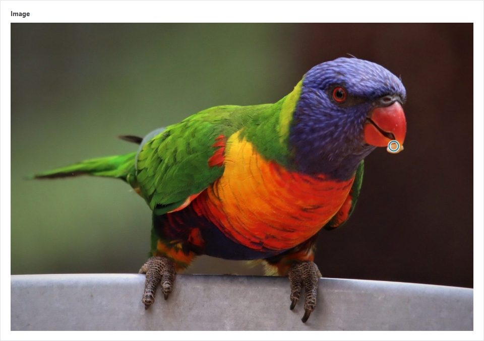

# ACF: FocusPoint

Adds a new "FocusPoint" field type to [Advanced Custom Fields](https://www.advancedcustomfields.com/) allowing users to select a focal point on images.

If you find this plugin useful, please consider sponsoring the development by clicking the Sponsor button or [directly through PayPal](https://paypal.me/ooksanen).

-----------------------

### Description

Adds a new field type to ACF allowing users to select a focal point on image.

Works similar to a traditional ACF image field, but once an image is selected and a preview is displayed, this plugin allows selecting a focal point by clicking on the image. Focal point is returned in image array as percentage from left/top.

Requires ACF Pro 5

Tested on ACF Pro 5.8.7

-----------------------

### Installation

1. Download and extract the plugin
2. Copy the `acf-focuspoint` folder into your `wp-content/plugins` folder
3. Activate the ACF FocusPoint plugin via the plugins admin page
4. Create a new field via ACF and select the FocusPoint type

-----------------------

### Usage

Usage is very similar to [ACF Image Field](http://www.advancedcustomfields.com/resources/image/). 

1. Select an image


2. Select a focal point by clicking the image preview



Plugin returns an array with image id and top/left values (percentages) of selected focus point:

```
'image' => array(
	'id'		=> 42,
	'top'  		=> 40.03,
	'left' 		=> 82.79,
)
```
Use these new values as you see fit. For example:

```
<?php 

$image = get_field('image'); 
$image_src = wp_get_attachment_image_src( $image['id'], 'large' );

?>

<style>
#my-image {
	background-image: url('<?php echo $image_src[0]; ?>);
	background-position: <?php echo $image['left'] . '% ' . $image['top']; ?>%;
	background-size: cover;
	height: 300px;
	width: 600px;
}
</style>

<div id="my-image"></div>
```

-----------------------

### Changelog

See [`changelog.md`](https://github.com/ooksanen/acf-focuspoint/blob/master/changelog.md)

-----------------------

### Thanks

Thanks to [Elliot Condon](http://www.elliotcondon.com/) for creating Advanced Custom Fields.
